# Bootimus-dnsmasq

[Bootimus](https://github.com/garybowers/bootimus?tab=readme-ov-file)

0.1.33之前的版本不支持proxy-dhcp，需要dnsmasq辅助。0.1.38版本作者内置了proxy-dhcp，可以不使用dnsmasq了。



```bash
# 0.1.33版本使用方法
git clone https://github.com/JIANMOP/Bootimus-dnsmasq.git
cd Bootimus-dnsmasq/dnsmasq/
mkdir data/
# 修改 docker-compose.yml 和 dnsmasq.conf 里的 ip 为你的宿主机静态 ip
docker compose up -d
# 浏览器访问 http://{你的ip}:8081 	bootimus 控制台 
docker logs bootimus | grep "Password"	# 初始账户 admin 密码
# 浏览器访问 http://{你的ip}:8080	dnsmasq 控制台

# 0.1.38版本使用方法
git clone https://github.com/JIANMOP/Bootimus-dnsmasq.git
cd Bootimus-dnsmasq/
mkdir data/
# 修改 docker-compose.yml 的ip为你的宿主机静态 ip
# 浏览器访问 http://{你的ip}:8081       bootimus 控制台
docker logs bootimus | grep "Password"  # 初始账户 admin 密码
```
